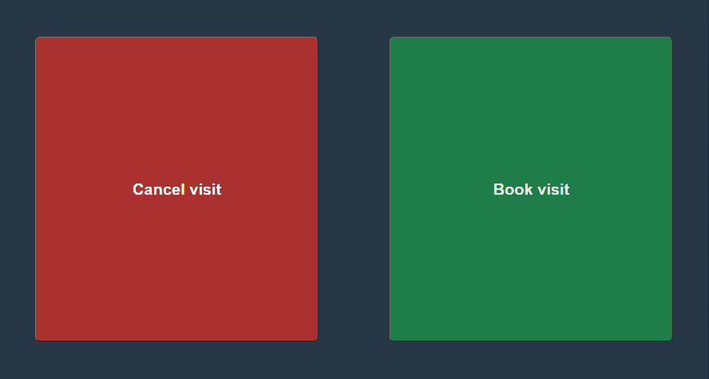
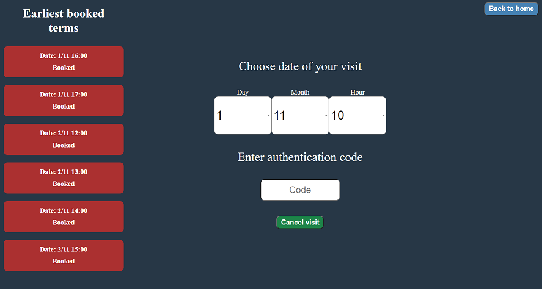
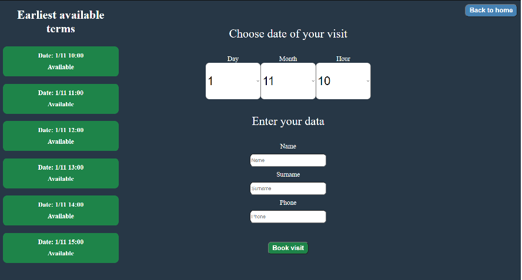
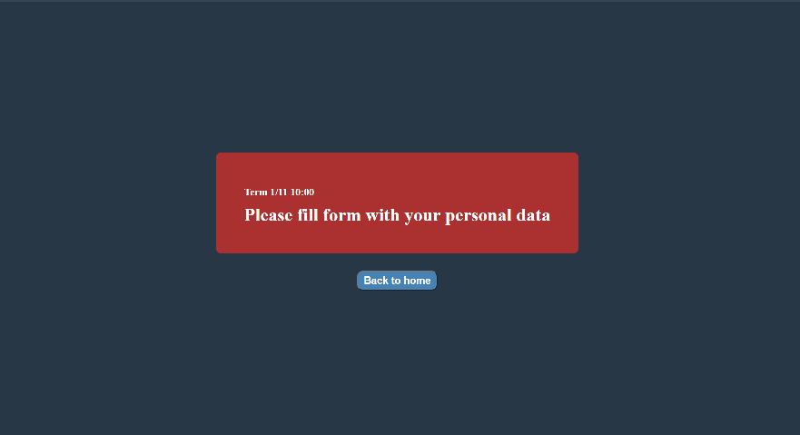
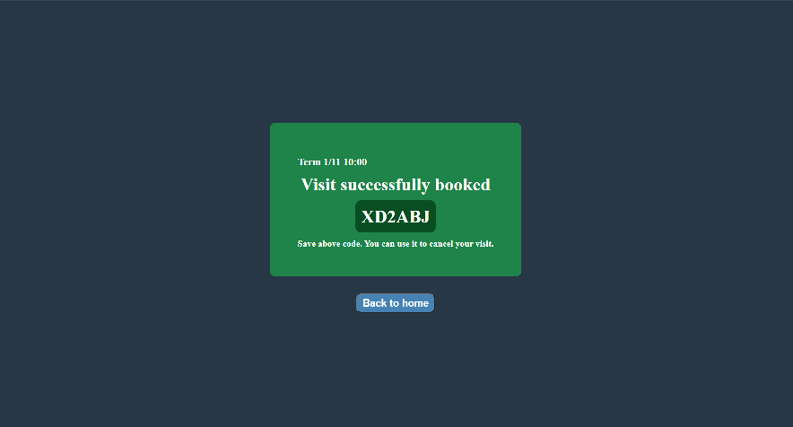
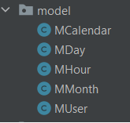

# Hairdresser

Simple hairdresser salon website written in [Spring Boot](https://spring.io).

## Prerequirements

`Maven build tool` - you can download it [here](http://maven.apache.org/download.cgi) 

## Compile & Run - Ubuntu
Enter project directory in terminal:

`cd <path to project>`

Run spring boot server:

`mvn spring-boot:run`

Enter your browser and type below url:

`http://localhost:8080`

## Web Layout

At a home page you can choose whether to book or cancel the visit:

**Figure: Home page**



Cancel view provide list of the earliest booked terms at the left side. It shows exact date of these unavailable visits. At the center of the view you can choose date of your visit, which you have booked. By passing authentication code of your visit and clicking `Cancel visit`, you are canceling visit at the hairdresser. At the right top `Back to home` button provides navigation to home page:

**Figure: Cancel page**



Book view is similar to cancel view. Instead of booked term, at the left side you can find earliest available terms. At the center of the view you can choose date of your visit. By passing your personal data into text fields and clicking `Book visit`, you are booking visit at the hairdresser. Button at the right top have the same functionality like at the cancel view:

**Figure: Book page**



After canceling or booking of the visit, final message are provided.

The negative one:

**Figure: Negative message**



The positive one:

**Figure: Positive message**



## Server backend

### Authorization code

`CodeGenerator` class provide pseudo code generation. It is basic implementation, where characters are randomly selected from `CHARACTERS_SET`. We don't check here if generated code already exists.

### Calendar database

Information about each term are stored in `calendar.xml`. `model` package containes classes, which are loaders and containers of this data. These classes reflects xml structure. `MHour` contains information about term, `MDay` contains list of `MHour`s in specific day, `MMonth` contains list of `MDay`s in specific month.. and so on. `MCalendar` are the highest in this hierarchy:

**Structure of calendar.xml**
```xml
<?xml version="1.0" encoding="UTF-8" standalone="no"?>
<calendar>
    <month id="11">
        <day id="1">
            <hour id="10">
                <booked>false</booked>
                <authenticationCode/>
                <name/>
                <surname/>
                <phone/>
            </hour>
        </day>
    </month>
</calendar>
```

**Structure of `model` package**



In sake of simplicity `model` layer provides only loading and updating existing terms - of course these updates are saved at `calendar.xml`. That's why we cannot create new terms. By default `calendar.xml` contain terms for november and decemeber and it is only terms available for users. Since only 2 months are available, information about year is not provided.

### Services

Classes from `service` package are connection between model and controller layer. On controller request, service retrieve information from model layer. For example left bar, where available or booked terms ale displayed, are provided by `CalendarInfo`. `VisitInfo` are some kind of container, which helps as manage [Thymeleaf](https://www.thymeleaf.org) mechanisms. `Visit` class let us cancel or book visit.

### Controllers

Controllers are first layer, where data from web page landing. Controller manage requests from user and then create response by using service layer.

### Test

`test` directory contain testing code, where [JUnit](https://junit.org/junit5/) are used.

